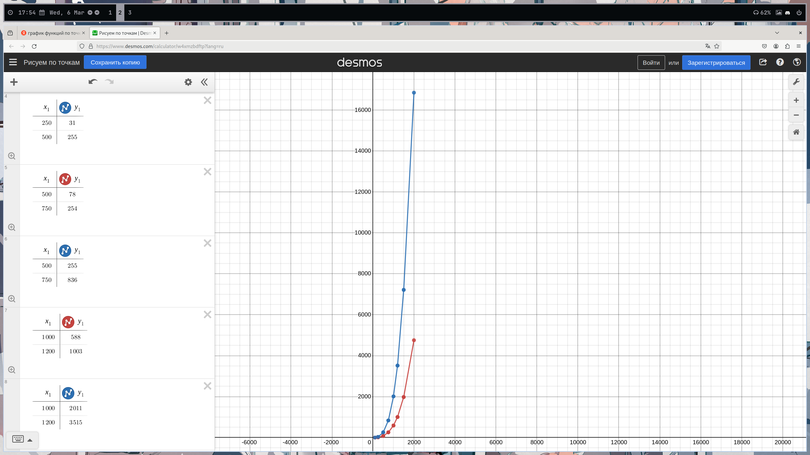

## Репозиторий с заданиями по Операционным Системам

### Задание 1
Задача состояла в том, чтобы написать алгоритм для вычисления произведения двух матриц с использованием нескольких потоков и сравнении скорости работы с вычислением "напрямую", перемножая строки на столбцы просто в цикле в одном потоке.

[Более подробное описание и код можно посмотреть здесь](./matrix_multiplication/)

### Задание 2
Суть задания была в том, чтобы воспроизвести проблему одновременого доступа к ресурсам несколькими потоками и применить несколько основных способов борьбы с этой проблемой.

[Более подробное описание и код можно посмотреть здесь](./mutex_task/)
