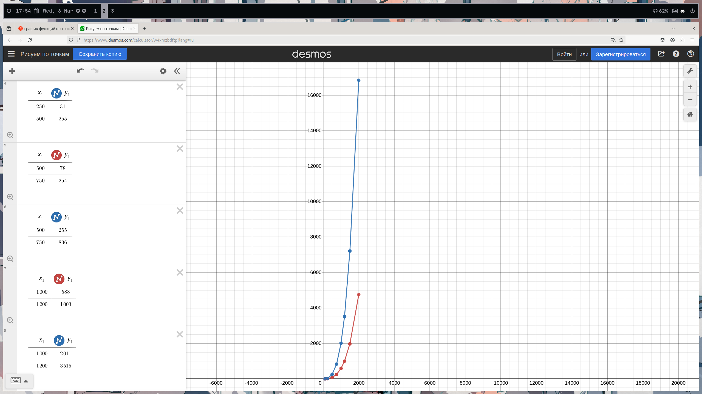
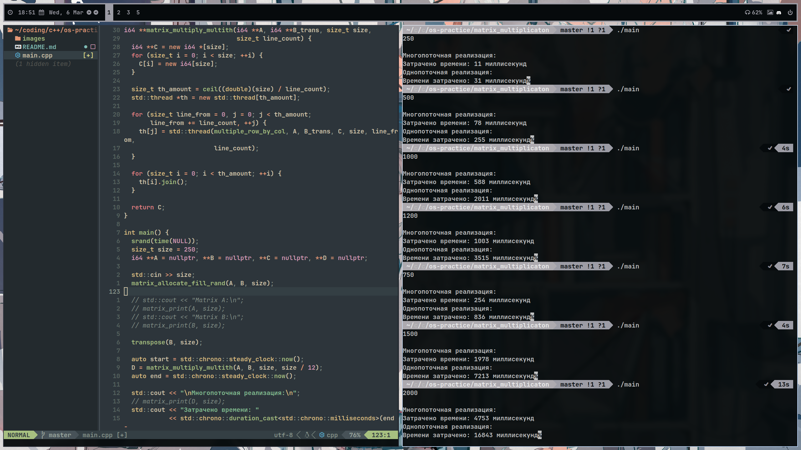
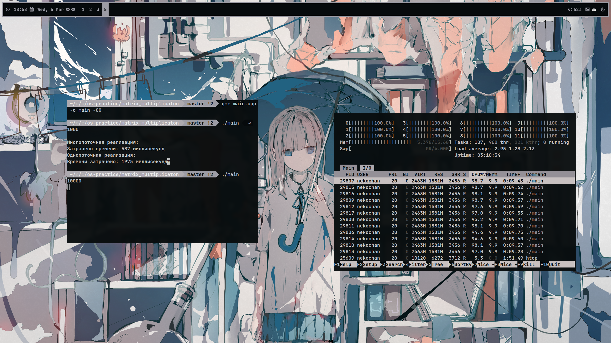

## Пояснение к выполненной задаче

### Задачи
1. Запрограммировать алгоритм для вычисления произведения матриц в одном потоке наивным методом.
2. Запрограммировать алгоритм для вычисления того же самого произведения, но уже с использованием многопоточности, применяя
```с++ std::thread```
3. Сравнить время работы алгоритмов.

### Пояснение к решению
Мной были запрограммированы алгоритмы и проведено сравнение скорости работы. Красным цветом показан график времени многопоточной реализации алгоритма, а синим -- однопоточной.

Как видно, параллелизация действительно даёт существенный прирост в производительности в сравнении с однопоточным вариантом. Ниже представлены результаты некоторых запусков программы. Компиляция производилась при помощи компилятора g++ без каких-либо оптимизаций.
 

Ну и, для чистоты эксперимента, скриншот cli-утилиты ```htop```, демонстрирующий равномерную загрузку всех ядер процессора при многопоточном вычислении произведения матриц.

### Вывод
Как видим, параллелизация действительно даёт существенный прирост в скорости работы программы. При прочих равных, алгоритм, использующий параллелизацию, показывал прирост в скорости в среднем в 3-4 раза.
