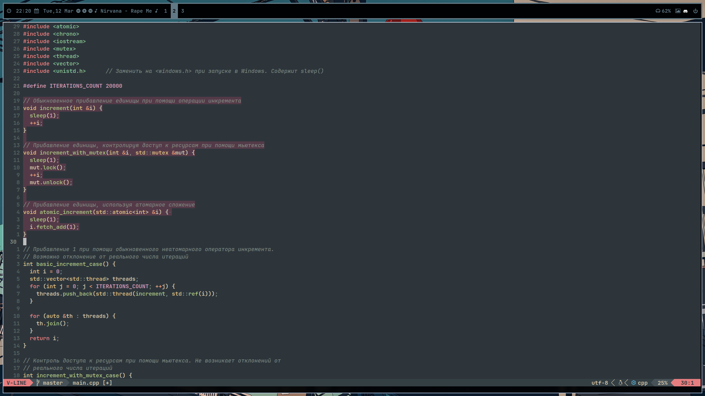
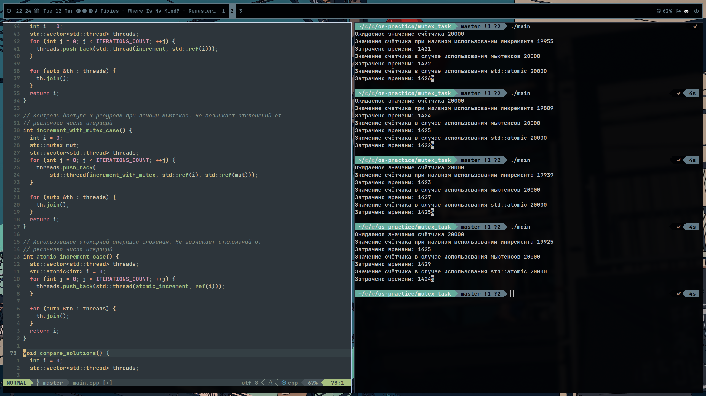

## Пояснение к выполненной задаче

### Задачи
1. Создать пример программы, которая работает некорректно из-за того, что несколько процессов обращаются к одной и той же области памяти одновременно.
2. Реализовать версию программы, работающую корректно, используя реализацию мьютеса ```std::mutex``` из STL.
3. Реализовать ещё одну версию программы, на этот раз решив проблему одновременного доступа к ресурсам, используя ```std::atomic<T>``` для атомарного сложения.

### Пояснение к решению
Сначала был реализован алгоритм для наивного прибавления единицы при помощи ```++i```. При тестировании возникла проблемка с тем, что совместный доступ к памяти на моём компьютере возникал сравнительно редко, по причине того, что операция инкремента выполняется крайне быстро, поэтому мной было принято решение добавить небольшую задержку в каждую из функций при помощи ```sleep(1)```. Одной миллисекунды было достаточно для того, чтобы наглядно увидеть расхождение в ожидаемом и полученном значениях счётчика i.

Также были написаны ещё 2 функции: одна с использованием мьютексов для блокирования остальных потоков выполнения на время выполнения ```++i```; и другая с применением ```std::atomic<int>::fetch_add(int)```, позволяющая прибавить к счётчику i единицу атомарным действием, не позволяя начаться новому потоку, пока функкция не завершила работу со старым значением i.


### Результаты тестов

В ходе тестов наивный способ действительно регулярно приводил к ошибочному результату. Функции, использующие мьютексы и атомики, закономерно, давали верный результат. Также мной было измерено время работы и вариант с атомиками всегда давал небольшой выигрыш в скорости по сравнению с мьютексами. Время наивной реализации было то ниже, то выше, чем у атомиков, но всегда ниже, чем с мьютексами.
